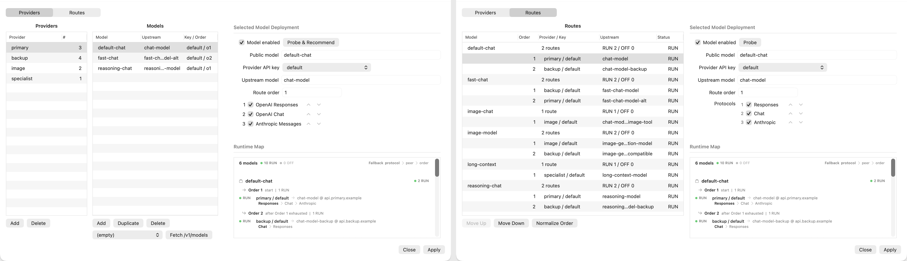

# LiteLLM Menu

LiteLLM Menu is a native macOS menu bar application that runs and manages a local [LiteLLM](https://github.com/BerriAI/litellm) proxy service. It consolidates multi-provider model routing, deployment fallback, Responses API compatibility, vision bridging, web search bridging, image generation tool adaptation, and Codex configuration into a single app-owned local endpoint.



---

## Features

### Native Menu Bar App

LiteLLM Menu runs as a macOS status bar application written in Swift. The menu app owns the local LiteLLM proxy lifecycle: it starts, stops, restarts, and monitors the proxy process. No Docker container, database, or system Python installation is required. Homebrew releases include a self-contained Python runtime and LiteLLM dependencies, so first launch does not download or compile packages. Source builds retain a bundled `uv` fallback for development.

The menu provides direct access to:

- Service status, start, stop, and restart
- Model configuration editor (providers, API keys, model routes, deployment order)
- Runtime settings (timeouts, cooldowns, web search limits, vision bridge, computer facade)
- Codex configuration (apply local LiteLLM endpoint, restore pre-switch config)
- WebDAV sync enable/disable and settings
- Route trace toggle and visual HTML report
- Service log, config watch log, and recent request log viewers
- Auto-start at login

### Deployment Fallback and Routing

Model groups contain multiple deployments across providers. Fallback is ordered by configured deployment `order`:

1. **Ordered protocol fallback within one deployment** — each deployment uses its `supported_upstream_url_surfaces` list exactly as configured, for example `openai/responses` → `openai/chat` → `anthropic`.
2. **Same-order peer fallback** — only after that deployment's selected protocols are exhausted does the proxy try another deployment with the same `order` value.
3. **Next-order fallback** — if no same-order peer is available, the proxy advances to the next higher `order`.
4. **Wrapped-order fallback** — if the failed deployment was the highest order, the proxy wraps to the lowest available order.

Cooldown is tracked independently for every deployment/protocol pair, so a failed Responses endpoint cannot cool down a healthy Chat or Anthropic endpoint on the same deployment. A deployment is excluded only while all of its configured protocols are cooling down. Cooldown and route-recovery state may use local files to coordinate workers, but both are cleared on service restart and successful Apply.

The routing constraint patch integrates exclusions and cooldowns directly into LiteLLM's `Router._get_all_deployments` and `get_available_deployment`, so all routing paths respect the active constraints.

### Responses API Compatibility

Upstreams can expose any ordered combination of OpenAI Responses (`/v1/responses`), Anthropic Messages (`/v1/messages`), and OpenAI Chat Completions (`/v1/chat/completions`). LiteLLM Menu preserves the user's protocol order and adapts a Responses client request to the selected upstream protocol.

The bridge handles:

- **Tool mapping** — Responses `function`, `custom`, and `tool_search` tool types are converted to Chat Completions function tools. Item IDs and tool call IDs are preserved.
- **User-defined surface order** — `supported_upstream_url_surfaces` is the single order source; its first item is the deployment's primary protocol.
- **Preemptive adaptation** — Chat and Anthropic selections are adapted before the upstream call rather than waiting for a Responses failure.
- **Streaming conversion** — Chat Completions stream chunks are converted to Responses stream events (`response.created`, `response.output_item.added`, `response.output_text.delta`, `response.completed`) for clients expecting Responses streaming.

### Image Generation Tool Adaptation

Responses API requests with `tools: [{"type": "image_generation"}]` are routed to deployments that declare `supports_responses_image_generation_tool: true` in their `model_info`. Routing is determined by structured metadata, not by prompt content or provider names.

If a capable deployment returns an empty response or an explicit image-tool-unavailable refusal, the proxy retries the same model group with `tool_choice: {"type": "image_generation"}` forced. Inline image data URLs are bounded to prevent oversized payloads from breaking compatible providers.

Standalone image model routes (`/v1/images/generations`) are handled separately from the Responses image generation tool.

### Vision Bridge

When a request contains image input and the selected route fails with a vision-unsupported error, the vision bridge rewrites the request to replace image content with textual visual context and retries the original route.

The bridge operates in three modes:

- **`auto`** (default) — tries a configured OpenAI-compatible vision endpoint first, then falls back to the bundled local Vision OCR helper.
- **`api`** — uses only the configured vision endpoint.
- **`local`** — uses only the bundled `vision_ocr` binary, which leverages macOS Vision framework for OCR text recognition and rectangle detection to produce layout summaries.

The bridge does not switch the user's model group to an unrelated chat route. It removes image parts from the original request, appends the visual context as text, and retries the same route.

### Web Search Bridge

When a Responses API request includes `web_search` tool usage:

1. **Native hosted search** is attempted first when route metadata indicates support or support is unknown on a Responses-capable route.
2. **External bridge** activates when the route is chat-only, explicitly lacks hosted web search support, or returns an unsupported hosted-tool error.

The external bridge uses DDGS (DuckDuckGo Search) for query execution and optional Jina Reader for page content excerpts. Search parameters — result count, page read count, read character limit, region, backend list, fetch timeout, max rounds, max queries, max open pages — are configurable through runtime settings.

The bridge exposes focused search queries and source URLs to the model. Query planning is model-driven; the bridge does not add request-specific query rewrites.

### Computer Facade

The computer facade adapts hosted `computer-use` tool requests for routes that do not natively support the computer tool. Supported backends:

- `auto` (default), `browser`, `chrome`, `playwright`, `mcp`, `cua`, `mock`

The facade intercepts computer action calls, routes them to the configured backend, and returns observations. Action denylists, max steps, trace logging, and screenshot tracing are configurable through environment variables and runtime settings.

### Codex Optimization

LiteLLM Menu includes targeted optimizations for [Codex](https://github.com/openai/codex) CLI and similar Responses API clients:

- **Codex config integration** — the menu switches only the required connection fields: top-level `model_provider`, provider `name = "OpenAI"`, provider `base_url`, `wire_api = "responses"`, `requires_openai_auth = true`, and `OPENAI_API_KEY`. The OpenAI provider identity keeps Codex's standalone `web.run` search available through the local `/alpha/search` endpoint. It never changes `model`. A field-level state file records only the previous values of managed fields, so restore cannot overwrite later changes to models, MCP servers, compaction, or other Codex settings.
- **Compaction controls** — request pre-processing adds compaction-related metadata and headers that Codex expects.
- **Reasoning effort compatibility** — when an upstream returns an error indicating `xhigh` reasoning effort is unsupported, the proxy retries with a compatible effort level (`high` or `max`) and records the compat retry.
- **Usage normalization** — the `response.completed` event's `usage` block is normalized to the Codex-expected schema (`input_tokens`, `output_tokens`, `input_tokens_details.cached_tokens`, `output_tokens_details.reasoning_tokens`, `total_tokens`), including conversion from Chat Completions `prompt_tokens`/`completion_tokens` naming.
- **Browser-compatible headers** — for providers that require standard browser headers, the proxy injects a browser User-Agent and Accept headers on retry.
- **Internal context stripping** — Codex internal context fragments (environment context, permissions, app context, skill/plugin instructions) are recognized and excluded from trace logging and request summaries.

### WebDAV Config Sync

Optional bidirectional configuration sync via WebDAV. The sync compares local state, remote state, and the last successful baseline to determine whether to push, pull, or merge. Settings (URL, credentials, remote name, sync interval, timeout) are configurable through the menu. Synced config bundles may contain API keys; credentials are stored locally with file permissions set to `0600`.

### Route Trace and Observability

Route trace logging records deployment selection, fallback decisions, surface bridging, vision bridge rewrites, web search bridge activity, image generation fallback, and streaming error recovery. The trace is viewable as an HTML report with per-request cards showing deployment metadata, event timeline, tool call details, and session context.

A recent requests log stores routing and status metadata in JSONL format. Prompt bodies, message content, authorization headers, and API keys are not stored.

### Config Watch and Validation

A launchd-backed config watcher monitors `config.yaml` for changes. On detection, it validates the config, stages the validated config to `.litellm-runtime/config.yaml`, and requires an explicit apply/restart to activate. The watcher does not silently restart the service on every file write. The runtime service always starts from the staged runtime config, not the editable source config.

---

## Installation

### Requirements

- macOS 13.0 or later
- Apple silicon Mac for the prebuilt Homebrew Cask
- [uv](https://docs.astral.sh/uv/) only when building from source (or set `LITELLM_UV_BIN` to a custom path)

### Homebrew (Recommended)

Add the tap once:

```bash
brew tap ysdj/litellm-menu https://github.com/ysdj/litellm-menu
```

Then install the app directly into `/Applications`:

```bash
brew install --cask litellm-menu
```

Open **LiteLLM Menu** from Applications after installation. Future updates only need `brew upgrade --cask litellm-menu`.

Homebrew downloads the prebuilt app and bundled runtime. Opening it starts the menu-owned service without a first-run dependency install.

### Manual Build

Clone the repository and build the app bundle:

```bash
git clone https://github.com/ysdj/litellm-menu.git
cd litellm-menu
./mac_menu/build.sh
```

The built app is placed at `/Applications/LiteLLM Menu.app` by default. To use a custom install path:

```bash
LITELLM_APP_PATH="/your/path/LiteLLM Menu.app" ./mac_menu/build.sh
```

Launch the app:

```bash
./app.sh open
```

### First Launch

1. Open LiteLLM Menu from the menu bar icon (the "LL" status item).
2. The Homebrew app starts the local LiteLLM proxy from its bundled runtime. A source-built app bootstraps its development runtime with `uv` when needed.
3. Click **Edit Models Config** to configure providers, API keys, models, and deployment order.
4. Click **Apply Config** (or restart the service) to stage and activate the configuration.
5. Optionally click **Configure Codex for LiteLLM** to point Codex at the local endpoint.

---

## Configuration

The primary configuration file is `~/.litellm-menu/config.yaml`. A sanitized example is provided as `config.example.yaml`.

### Key Sections

- **`providers`** — named provider groups with `api_base` and `api_keys` (each key has `name`, `value`, and `enabled` flag).
- **`model_list`** — model group entries with `litellm_params` (model, api_base, api_key, order) and `model_info` (id, provider, route_key, api_key_name, capability flags).
- **`litellm_settings`** — callbacks registration, `public_model_groups`, `drop_params`.
- **`router_settings`** — routing strategy, retry policy, max fallbacks, cooldown configuration.
- **`general_settings`** — master key, UI toggle.

The model editor keeps the client-facing public model name separate from the exact upstream model ID. It derives LiteLLM's internal provider prefix from the first configured upstream API surface (`openai` for OpenAI Responses or Chat, `anthropic` for Anthropic Messages), so there is no separate adapter setting. This permits mappings such as a GPT-compatible public route backed by a differently named OpenAI-compatible upstream model without changing the upstream ID.

### Capability Flags

Each deployment's `model_info` supports:

- `supports_responses_image_generation_tool` — whether the upstream supports the Responses image generation tool.
- `supported_upstream_url_surfaces` — enabled API surfaces in numbered order (`openai/responses`, `openai/chat`, `anthropic`); the first item is primary.
- `x-litellm-menu-upstream-url-surface-order` — editor metadata that preserves the complete numbered order, including unchecked protocols.
- `upstream_url_surface` — generated mirror of the first ordered surface.
- `supports_responses_web_search` / `supports_web_search` — web search capability.

The model editor has one **Probe** action. For text models it checks the upstream Responses, Chat Completions, and Anthropic Messages APIs serially. **Upstream API order** means the fallback order from LiteLLM to the deployment endpoint; it does not change the client-facing API. Move a row to change priority and check it to enable that API. The default recommendation is Responses → Chat → Anthropic. When the recommendation already matches the numbered order, probing completes without an alert and leaves the enabled APIs unchanged. Known standalone image models probe only `/v1/images/generations`; an unconfigured new model is classified as an image model only when all three text APIs are definitively unavailable and the image probe succeeds.

### Runtime Settings

Adjustable through the menu without editing config files:

| Setting | Environment Variable | Default |
|---|---|---|
| Stall timeout | `LITELLM_MENU_STALL_TIMEOUT_SECONDS` | 120 |
| Request timeout | `LITELLM_MENU_REQUEST_TIMEOUT_SECONDS` | 7200 |
| Deployment cooldown failures | `LITELLM_MENU_DEPLOYMENT_COOLDOWN_FAILURES` | 2 |
| Deployment cooldown seconds | `LITELLM_MENU_DEPLOYMENT_COOLDOWN_SECONDS` | 300 |
| Web search max results | `LITELLM_MENU_WEB_SEARCH_MAX_RESULTS` | 8 |
| Web search read results | `LITELLM_MENU_WEB_SEARCH_READ_RESULTS` | 4 |
| Web fetch timeout | `LITELLM_MENU_WEB_FETCH_TIMEOUT_SECONDS` | 30 |
| Vision bridge backend | `LITELLM_MENU_VISION_BRIDGE_BACKEND` | auto |
| Vision bridge model | `LITELLM_MENU_VISION_BRIDGE_MODEL` | qwen2.5vl:3b |
| Computer facade backend | `LITELLM_MENU_COMPUTER_FACADE_BACKEND` | auto |
| Computer facade max steps | `LITELLM_MENU_COMPUTER_FACADE_MAX_STEPS` | 20 |
| Route recovery interval | `LITELLM_MENU_RECOVERY_INTERVAL_SECONDS` | 5 |

---

## CLI Usage

The `app.sh` script provides app-level control:

```bash
./app.sh open      # Launch or focus the menu app (builds if needed)
./app.sh restart   # Rebuild, stop, and relaunch
./app.sh close     # Stop service and quit the app
./app.sh version   # Print app version
```

The `service.sh` script provides direct service control for source checkouts:

```bash
./service.sh status
./service.sh start
./service.sh stop
./service.sh restart
./service.sh tail
./service.sh route-trace-html
```

---

## Development

### Running Tests

```bash
./scripts/test.sh
```

For targeted tests:

```bash
./scripts/test.sh test_hooks_routing
```

### Building the App

After changing Swift sources, Python service code, service scripts, or bundled resources:

```bash
./mac_menu/build.sh
```

For installed app behavior verification, the complete path is: build the app, restart the real menu-owned service, then verify on the normal local service.

### Version Management

`VERSION`, `BUILD_NUMBER`, `mac_menu/Info.plist`, and `Casks/litellm-menu.rb` are kept in sync through `scripts/version.py`.

LiteLLM uses a two-stage version policy. Development explicitly advances `LITELLM_VERSION` to the latest stable PyPI release that provides a universal wheel with `./scripts/update-litellm.sh`; releases without a macOS-compatible binary are skipped so app startup never compiles LiteLLM from source. `./scripts/update-litellm.sh --check` fails when the compatible lock is stale. Built and released apps copy that lock and install exactly `litellm[proxy]==<locked version>`, so a release never changes SDK versions merely because a user starts or restarts the service later. After advancing the lock, rebuild, restart, and run the full test suite before release.

---

## License

MIT License. See [LICENSE](LICENSE).

---

---

# LiteLLM Menu（中文）

LiteLLM Menu 是一个原生 macOS 菜单栏应用，用于运行和管理本地 [LiteLLM](https://github.com/BerriAI/litellm) 代理服务。它将多供应商模型路由、部署回退、Responses API 兼容、视觉桥接、网页搜索桥接、图像生成工具适配，以及 Codex 配置整合到一个由应用管理的本地端点中。

---

## 功能特性

### 原生菜单栏应用

LiteLLM Menu 以 Swift 编写，作为 macOS 状态栏应用运行。菜单应用拥有本地 LiteLLM 代理进程的完整生命周期管理：启动、停止、重启和监控。无需 Docker 容器、数据库或系统 Python 安装。Homebrew 发布包已内置独立 Python 运行时与 LiteLLM 依赖，首次启动无需下载或编译软件包；源码构建仍保留内置 `uv` 作为开发兜底。

菜单提供以下功能的直接访问：

- 服务状态、启动、停止和重启
- 模型配置编辑器（供应商、API 密钥、模型路由、部署顺序）
- 运行时设置（超时、冷却、网页搜索限制、视觉桥接、computer facade）
- Codex 配置（应用本地 LiteLLM 端点、恢复切换前配置）
- WebDAV 同步启用/禁用和设置
- 路由追踪开关和可视化 HTML 报告
- 服务日志、配置监听日志和最近请求日志查看器
- 登录时自启动

### 部署回退与路由

模型组包含跨供应商的多个部署。回退按配置的部署 `order` 排序：

1. **部署内有序协议回退** — 每个部署严格按 `supported_upstream_url_surfaces` 配置尝试，例如 `openai/responses` → `openai/chat` → `anthropic`。
2. **同序对等回退** — 当前部署选中的协议都尝试完后，才尝试同一 `order` 下的其他供应商或 API 密钥。
3. **下一序回退** — 无同序对等部署可用时，代理前进到下一个更高的 `order`。
4. **环绕回退** — 失败部署已是最高序时，代理环绕到最低可用序。

冷却按“部署 + 协议”独立记录，因此坏掉的 Responses 不会连累同一部署中健康的 Chat 或 Anthropic。只有配置的全部协议都处于冷却时，部署才会被排除。冷却和 recovery 可以用本地文件协调多个 worker，但服务重启和成功 Apply 后都会清空。

路由约束补丁将排除和冷却直接集成到 LiteLLM 的 `Router._get_all_deployments` 和 `get_available_deployment` 中，使所有路由路径均遵循当前约束。

### Responses API 兼容

上游可按任意顺序支持 OpenAI Responses（`/v1/responses`）、Anthropic Messages（`/v1/messages`）和 OpenAI Chat Completions（`/v1/chat/completions`）。LiteLLM Menu 保留用户配置的协议顺序，并将 Responses 客户端请求适配到选中的上游协议。

桥接器处理以下内容：

- **工具映射** — Responses 的 `function`、`custom` 和 `tool_search` 工具类型转换为 Chat Completions 的 function 工具。项 ID 和工具调用 ID 予以保留。
- **用户自定义接口顺序** — `supported_upstream_url_surfaces` 是唯一顺序真源，第一项为主协议。
- **预先适配** — 选中 Chat 或 Anthropic 时，在调用上游前完成适配，无需先等待 Responses 失败。
- **流式转换** — Chat Completions 流式数据块转换为 Responses 流式事件（`response.created`、`response.output_item.added`、`response.output_text.delta`、`response.completed`），供期望 Responses 流式的客户端使用。

### 图像生成工具适配

包含 `tools: [{"type": "image_generation"}]` 的 Responses API 请求被路由到在 `model_info` 中声明 `supports_responses_image_generation_tool: true` 的部署。路由由结构化元数据决定，而非提示词内容或供应商名称。

当能力部署返回空响应或明确的图像工具不可用拒绝时，代理以强制 `tool_choice: {"type": "image_generation"}` 重试同一模型组。内联图像 data URL 受到大小限制，以防止过大负载破坏兼容供应商。

独立图像模型路由（`/v1/images/generations`）与 Responses 图像生成工具分开处理。

### 视觉桥接

当请求包含图像输入且所选路由返回视觉不支持的错误时，视觉桥接器将请求中的图像内容替换为文本视觉上下文，并重试原始路由。

桥接器有三种模式：

- **`auto`**（默认）— 先尝试已配置的 OpenAI 兼容视觉端点，失败后回退到内置本地 Vision OCR 辅助工具。
- **`api`** — 仅使用已配置的视觉端点。
- **`local`** — 仅使用内置 `vision_ocr` 二进制工具，该工具利用 macOS Vision 框架进行 OCR 文本识别和矩形检测，生成布局摘要。

桥接器不会将用户的模型组切换到无关的聊天路由。它移除原始请求中的图像部分，以文本形式附加视觉上下文，并重试同一路由。

### 网页搜索桥接

当 Responses API 请求包含 `web_search` 工具使用时：

1. **原生托管搜索** — 路由元数据表明支持或支持状态未知时，优先在支持 Responses 的路由上尝试原生托管搜索。
2. **外部桥接** — 路由仅支持聊天、明确不支持托管网页搜索，或返回不支持托管工具错误时激活。

外部桥接使用 DDGS（DuckDuckGo Search）执行查询，使用可选的 Jina Reader 获取页面内容摘要。搜索参数 — 结果数量、页面读取数量、读取字符限制、区域、后端列表、获取超时、最大轮次、最大查询数、最大打开页面数 — 均可通过运行时设置配置。

桥接器向模型暴露聚焦的搜索查询和来源 URL。查询规划由模型驱动；桥接器不添加特定于请求的查询重写。

### Computer Facade

Computer facade 为不支持原生 computer 工具的路由适配托管的 `computer-use` 工具请求。支持的后端：

- `auto`（默认）、`browser`、`chrome`、`playwright`、`mcp`、`cua`、`mock`

Facade 拦截 computer 动作调用，路由到已配置的后端，并返回观察结果。动作拒绝列表、最大步数、追踪日志和截图追踪可通过环境变量和运行时设置配置。

### Codex 优化

LiteLLM Menu 包含针对 [Codex](https://github.com/openai/codex) CLI 及类似 Responses API 客户端的定向优化：

- **Codex 配置集成** — 菜单只切换必要连接字段：顶层 `model_provider`、供应商 `name = "OpenAI"`、`base_url`、`wire_api = "responses"`、`requires_openai_auth = true` 和 `OPENAI_API_KEY`。OpenAI 供应商身份会让 Codex 保留 standalone `web.run` 搜索，并通过本地 `/alpha/search` 端点执行。绝不修改 `model`。恢复状态只记录这些受管字段的原值，因此不会覆盖之后修改的模型、MCP、压缩或其他 Codex 设置。
- **压缩控制** — 请求预处理添加 Codex 所需的压缩相关元数据和头信息。
- **推理强度兼容** — 上游返回表明 `xhigh` 推理强度不支持的错误时，代理以兼容强度级别（`high` 或 `max`）重试，并记录兼容重试。
- **用量归一化** — `response.completed` 事件的 `usage` 块被归一化为 Codex 期望的架构（`input_tokens`、`output_tokens`、`input_tokens_details.cached_tokens`、`output_tokens_details.reasoning_tokens`、`total_tokens`），包括从 Chat Completions 的 `prompt_tokens`/`completion_tokens` 命名转换。
- **浏览器兼容头** — 对需要标准浏览器头的供应商，代理在重试时注入浏览器 User-Agent 和 Accept 头。
- **内部上下文剥离** — Codex 内部上下文片段（环境上下文、权限、应用上下文、技能/插件指令）被识别并从追踪日志和请求摘要中排除。

### WebDAV 配置同步

通过 WebDAV 进行可选的双向配置同步。同步逻辑比较本地状态、远程状态和上次成功基线，决定推送、拉取还是合并。设置（URL、凭据、远程名称、同步间隔、超时）可通过菜单配置。同步的配置包可能包含 API 密钥；凭据以本地文件存储，文件权限设为 `0600`。

### 路由追踪与可观测性

路由追踪日志记录部署选择、回退决策、接口桥接、视觉桥接重写、网页搜索桥接活动、图像生成回退和流式错误恢复。追踪以 HTML 报告形式查看，包含每个请求的卡片，展示部署元数据、事件时间线、工具调用详情和会话上下文。

最近请求日志以 JSONL 格式存储路由和状态元数据。不存储提示词正文、消息内容、授权头和 API 密钥。

### 配置监听与验证

由 launchd 支持的配置监听器监控 `config.yaml` 的变更。检测到变更后，验证配置，将验证通过的配置暂存到 `.litellm-runtime/config.yaml`，并要求显式的应用/重启操作才能激活。监听器不会在每次文件写入时静默重启服务。运行时服务始终从暂存的运行时配置启动，而非可编辑的源配置。

---

## 安装

### 系统要求

- macOS 13.0 或更高版本
- 预构建 Homebrew Cask 目前要求 Apple silicon Mac
- 仅源码构建需要 [uv](https://docs.astral.sh/uv/)（也可设置 `LITELLM_UV_BIN` 指向自定义路径）

### Homebrew 安装（推荐）

首次添加一次 tap：

```bash
brew tap ysdj/litellm-menu https://github.com/ysdj/litellm-menu
```

之后用短命令直接把应用安装到 `/Applications`：

```bash
brew install --cask litellm-menu
```

安装后直接从“应用程序”打开 **LiteLLM Menu**。以后更新只需运行 `brew upgrade --cask litellm-menu`。

Homebrew 会下载预构建应用及其内置运行时。打开后直接启动由菜单管理的服务，首次运行不会安装依赖。

### 手动构建

克隆仓库并构建应用包：

```bash
git clone https://github.com/ysdj/litellm-menu.git
cd litellm-menu
./mac_menu/build.sh
```

构建的应用默认放置于 `/Applications/LiteLLM Menu.app`。使用自定义安装路径：

```bash
LITELLM_APP_PATH="/your/path/LiteLLM Menu.app" ./mac_menu/build.sh
```

启动应用：

```bash
./app.sh open
```

### 首次启动

1. 从菜单栏图标（"LL" 状态项）打开 LiteLLM Menu。
2. Homebrew 应用直接从内置运行时启动本地 LiteLLM 代理；源码构建仅在需要时使用 `uv` 引导开发运行时。
3. 点击 **Edit Models Config** 配置供应商、API 密钥、模型和部署顺序。
4. 点击 **Apply Config**（或重启服务）暂存并激活配置。
5. 可选：点击 **Configure Codex for LiteLLM** 将 Codex 指向本地端点。

---

## 配置

主配置文件为 `~/.litellm-menu/config.yaml`。仓库提供已脱敏的示例文件 `config.example.yaml`。

### 主要配置段

- **`providers`** — 命名供应商组，包含 `api_base` 和 `api_keys`（每个密钥有 `name`、`value` 和 `enabled` 标志）。
- **`model_list`** — 模型组条目，包含 `litellm_params`（model、api_base、api_key、order）和 `model_info`（id、provider、route_key、api_key_name、能力标志）。
- **`litellm_settings`** — 回调注册、`public_model_groups`、`drop_params`。
- **`router_settings`** — 路由策略、重试策略、最大回退数、冷却配置。
- **`general_settings`** — 主密钥、UI 开关。

模型编辑器将客户端看到的公开模型名与上游原始模型 ID 分开保存。LiteLLM 内部供应商前缀由第一个上游 API 协议自动派生（OpenAI Responses 或 Chat 使用 `openai`，Anthropic Messages 使用 `anthropic`），不再单独配置 adapter。这样可以把 GPT 兼容的公开路由映射到名称不同的 OpenAI-compatible 上游模型，同时保持上游 ID 不变。

### 能力标志

每个部署的 `model_info` 支持：

- `supports_responses_image_generation_tool` — 上游是否支持 Responses 图像生成工具。
- `supported_upstream_url_surfaces` — 按编号排序的已启用 API 接口列表（`openai/responses`、`openai/chat`、`anthropic`），第一项是主协议。
- `x-litellm-menu-upstream-url-surface-order` — 编辑器元数据，用于保留包括未勾选协议在内的完整编号顺序。
- `upstream_url_surface` — 自动生成的第一项镜像。
- `supports_responses_web_search` / `supports_web_search` — 网页搜索能力。

模型编辑器只保留一个 **Probe** 操作。文本模型会依次探测上游 Responses、Chat Completions 和 Anthropic Messages API。**上游 API 顺序** 指 LiteLLM 到该部署端点的回退顺序，不会改变客户端接口。移动行调整优先级，勾选决定是否启用该 API。默认推荐顺序为 Responses → Chat → Anthropic。当推荐顺序已与编号顺序一致时，探测不会弹窗，也不会改变当前启用状态。已知的独立图片模型只探测 `/v1/images/generations`；尚未配置的新模型只有在三个文本 API 都明确不可用且图片探针成功时，才会被识别为图片模型。

### 运行时设置

可通过菜单调整，无需编辑配置文件：

| 设置项 | 环境变量 | 默认值 |
|---|---|---|
| 停滞超时 | `LITELLM_MENU_STALL_TIMEOUT_SECONDS` | 120 |
| 请求超时 | `LITELLM_MENU_REQUEST_TIMEOUT_SECONDS` | 7200 |
| 部署冷却失败次数 | `LITELLM_MENU_DEPLOYMENT_COOLDOWN_FAILURES` | 2 |
| 部署冷却秒数 | `LITELLM_MENU_DEPLOYMENT_COOLDOWN_SECONDS` | 300 |
| 网页搜索最大结果数 | `LITELLM_MENU_WEB_SEARCH_MAX_RESULTS` | 8 |
| 网页搜索读取结果数 | `LITELLM_MENU_WEB_SEARCH_READ_RESULTS` | 4 |
| 网页获取超时 | `LITELLM_MENU_WEB_FETCH_TIMEOUT_SECONDS` | 30 |
| 视觉桥接后端 | `LITELLM_MENU_VISION_BRIDGE_BACKEND` | auto |
| 视觉桥接模型 | `LITELLM_MENU_VISION_BRIDGE_MODEL` | qwen2.5vl:3b |
| Computer facade 后端 | `LITELLM_MENU_COMPUTER_FACADE_BACKEND` | auto |
| Computer facade 最大步数 | `LITELLM_MENU_COMPUTER_FACADE_MAX_STEPS` | 20 |
| 路由恢复间隔 | `LITELLM_MENU_RECOVERY_INTERVAL_SECONDS` | 5 |

---

## 命令行使用

`app.sh` 脚本提供应用级控制：

```bash
./app.sh open      # 启动或聚焦菜单应用（需要时构建）
./app.sh restart   # 重新构建、停止并重启
./app.sh close     # 停止服务并退出应用
./app.sh version   # 输出应用版本
```

`service.sh` 脚本为源码检出目录提供直接服务控制：

```bash
./service.sh status
./service.sh start
./service.sh stop
./service.sh restart
./service.sh tail
./service.sh route-trace-html
```

---

## 开发

### 运行测试

```bash
./scripts/test.sh
```

指定测试：

```bash
./scripts/test.sh test_hooks_routing
```

### 构建应用

修改 Swift 源码、Python 服务代码、服务脚本或内置资源后：

```bash
./mac_menu/build.sh
```

验证已安装应用行为的完整路径：构建应用、重启实际的菜单所辖服务、然后在正常的本地服务上验证。

### 版本管理

`VERSION`、`BUILD_NUMBER`、`mac_menu/Info.plist` 和 `Casks/litellm-menu.rb` 通过 `scripts/version.py` 保持同步。

LiteLLM 采用两阶段版本策略。开发时用 `./scripts/update-litellm.sh` 显式把 `LITELLM_VERSION` 推进到提供通用 wheel 的 PyPI 最新稳定版；缺少 macOS 兼容二进制包的版本会被跳过，避免应用启动时现场编译 LiteLLM。`./scripts/update-litellm.sh --check` 会在兼容版本锁落后时失败。构建和发布的应用会复制这个锁，并精确安装 `litellm[proxy]==<锁定版本>`，因此用户以后启动或重启服务时不会意外漂移 SDK 版本。更新版本锁后，发布前必须重新构建、重启并运行全套测试。

---

## 许可证

MIT 许可证。详见 [LICENSE](LICENSE)。
